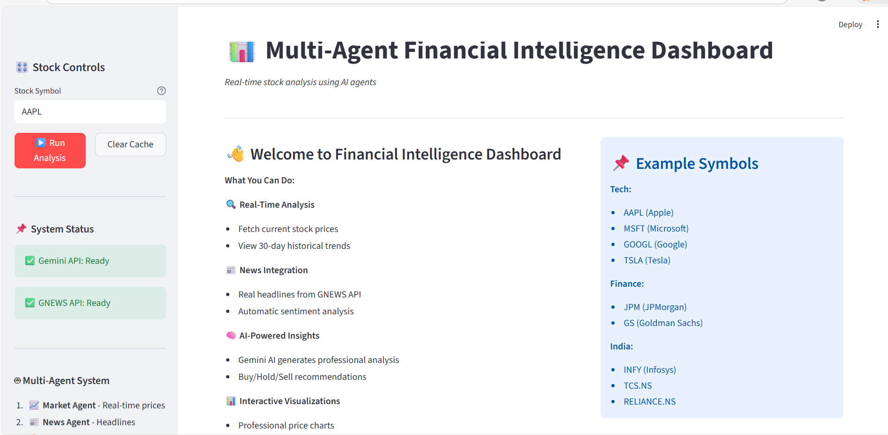
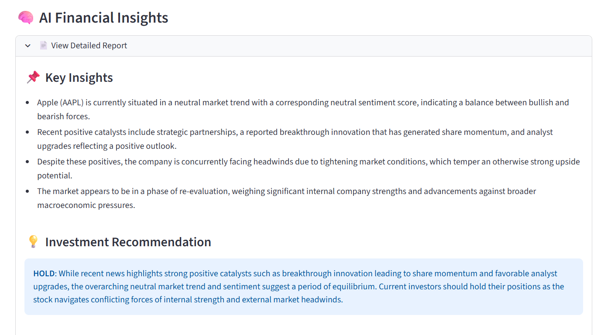

# 📈 Multi-Agent Financial Analysis System

AI-powered stock analysis combining 5 specialized agents with real-time market data, news sentiment analysis, and Gemini AI insights.

## 🎯 Quick Start

### 1. Setup
```bash
git clone https://github.com/sravanig8/financial-analysis-system.git
cd financial-analysis-system
python -m venv venv
venv\Scripts\activate  # Windows
pip install -r requirements.txt
```

### 2. Configure API Keys
Set environment variables:
```
GEMINI_API_KEY=your-api-key-here
GNEWS_API_KEY=your-gnews-key-here (optional)
```

**Get Free Keys:**
- **Gemini**: https://aistudio.google.com/app/apikeys
- **GNEWS**: https://gnews.io (optional - system has fallback)

### 3. Run

**Web Dashboard (Recommended):**
```bash
streamlit run app.py
```

**CLI Tool:**
```bash
python main.py
```

## 📊 Dashboard Screenshots

### Main Dashboard - Real-Time Stock Analysis Interface

*Multi-Agent Financial Intelligence Dashboard showing real-time market data, news integration, sentiment analysis, and AI-powered insights*

### Price Chart & Trends


### AI Insights Panel  


## 🎥 Demo Video

[Watch Full Demo](screenshots/demo.mp4)

## ✨ Features

- 🔄 **5 AI Agents**: Market → News → Sentiment → Analysis → Gemini Report
- 📊 **Real-Time Data**: Live prices & 30-day historical trends
- 🗞️ **News Headlines**: Real news from GNEWS API or auto-generated fallback
- 💭 **Sentiment Analysis**: TextBlob NLP analysis (-1 to +1 scale)
- 🤖 **Gemini AI**: Professional insights & buy/hold/sell recommendations
- 🎨 **Beautiful Dashboard**: Interactive Plotly charts, KPI cards, styled layout
- ⚡ **100% Free**: All APIs have free tiers

## 🏗️ Architecture

```
Input: Stock Symbol (e.g., AAPL)
           ↓
       ┌───┴─────────────┐
       │ Market Agent    │ → Fetch price & 30-day data
       └───┬─────────────┘
           │
    ┌──────┼──────┐
    ↓      ↓      ↓
  News   Sentiment Analysis
  Agent   Agent    Agent
    │      │      │
    └──────┼──────┘
           ↓
      Report Agent (Gemini)
           ↓
    Comprehensive Report
```

## 📁 Project Structure

```
financial-analysis-system/
├── app.py                  # Streamlit dashboard
├── main.py                 # CLI interface
├── agents/
│   ├── market_agent.py     # Stock prices (yfinance)
│   ├── news_agent.py       # Headlines (GNEWS)
│   ├── sentiment_agent.py  # Emotion detection
│   ├── analysis_agent.py   # Technical indicators
│   └── report_agent.py     # Gemini AI
├── utils/
│   └── indicators.py       # Math utilities
└── requirements.txt        # Dependencies
```

## 🤖 Agent Details

| Agent | Input | Output | Tech |
|-------|-------|--------|------|
| **Market** | Symbol | Current price, 30-day history | yfinance |
| **News** | Symbol | 5-8 headlines | GNEWS API |
| **Sentiment** | Headlines | Emotion scores | TextBlob |
| **Analysis** | Prices | 7-day & 30-day MA, trend | Math |
| **Report** | All data | Insights & recommendation | Gemini |

## 🔧 Installation

```bash
# Clone
git clone https://github.com/sravanig8/financial-analysis-system.git
cd financial-analysis-system

# Virtual Environment
python -m venv venv
venv\Scripts\activate

# Dependencies
pip install -r requirements.txt
python -m textblob.download_corpora

# Environment Variables (PowerShell)
$env:GEMINI_API_KEY="your-key"
$env:GNEWS_API_KEY="your-key"  # optional

# Run
streamlit run app.py
```

## 📖 Usage

### Web Interface
1. Enter stock symbol (AAPL, TSLA, MSFT)
2. Click "Analyze Stock"
3. View price chart, sentiment, headlines, AI insights

### CLI
```bash
python main.py
# Enter symbol when prompted
```

## 🔑 API Keys

### Gemini (Required)
- Free tier with generous limits
- Get here: https://aistudio.google.com/app/apikeys

### GNEWS (Optional)
- System works without it (uses generated samples)
- Get here: https://gnews.io

## 📊 How It Works

```
1. You enter: AAPL
2. Market Agent: Fetches current price ($175.50)
3. News Agent: Finds 5-8 headlines
4. Sentiment Agent: Analyzes if positive/negative
5. Analysis Agent: Computes moving averages
6. Report Agent: Generates Gemini AI insights
7. Dashboard: Shows everything with indicators
```

## 🛠️ Troubleshooting

| Issue | Fix |
|-------|-----|
| API key not found | Set `GEMINI_API_KEY` environment variable |
| "No data found" | Use correct symbol (try AAPL) |
| Module not found | Run `pip install -r requirements.txt` |
| TextBlob error | Run `python -m textblob.download_corpora` |

## 📝 Example Output

```
Current Price: $175.50
Trend: Bullish 🟢
Sentiment: Positive (+0.28)

Technical:
  • 7-Day MA: $174.20
  • 30-Day MA: $170.85

AI Recommendation: BUY
Summary: Strong quarterly performance with expanding market presence
```

## ⚖️ Disclaimer

Educational purposes only. Not financial advice. Consult professionals before investing.

## 🎬 Adding Screenshots & Video to GitHub

1. **Create `screenshots/` folder**
2. **Add screenshots** (use Windows Snipping Tool - Win+Shift+S):
   - `dashboard.png` - Main dashboard
   - `chart.png` - Price chart
   - `insights.png` - AI insights
3. **Add demo video** (use OBS Studio or Win+G):
   - `demo.mp4` - Screen recording of dashboard in action
4. **Commit & push**:
   ```bash
   git add screenshots/
   git commit -m "Add screenshots and demo video"
   git push origin main
   ```

## 📦 Requirements

- Python 3.10+
- Internet connection
- Free Gemini API key

## 🙏 Credits

- Google Gemini for AI insights
- yfinance for market data
- TextBlob for NLP
- Streamlit for UI framework

---

**Built with ❤️ using Multi-Agent AI**
